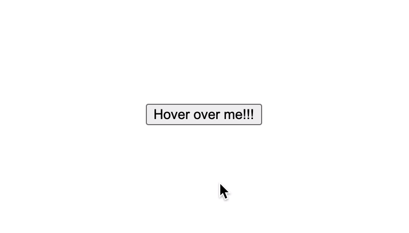
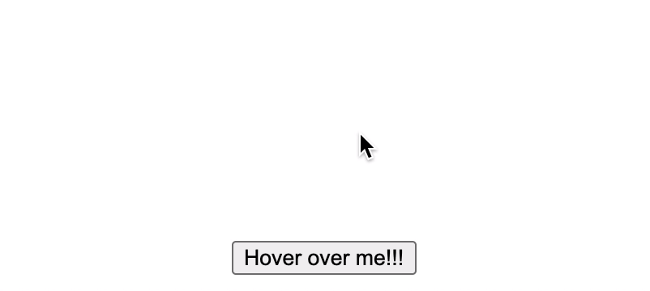

# Angular compatibility
|This library       |Angular      |
|-------------------|-------------|
|1.0.0              |^12          |
|2.0.0              |<=13.2.0      |

<br/>

# Installation
```
npm i -S angular-simple-tooltip
```

<br/>

# Setting up
```typescript
import { TooltipModule } from 'angular-simple-tooltip';

@Module({
    imports: [
        TooltipModule // Make `TooltipDirective` available in your module
    ]
})
export class YourModule {

}
```

<br/>

# Accessibility
The tooltip component that gets created handles wiring up `aria-describedby` attribute for accessability between the tooltip trigger and the tooltip content, so it's completely transparent to you as the API user.

# Using `TooltipDirective`
`TooltipModule` exports an attribute directive called `TooltipDirective` that you can apply to any elements in your templates to trigger a tooltip on hover/keyboard navigation (when users focus on the tooltip trigger by pressing the tab key)/long presses on mobile devices.
The followings are the `@Input` properties that `TooltipDirective` accepts
- `kunTooltip` Configures the tooltip's content
- `kunTooltipPlacement` Configures tooltip's placement, valid values are `top`, `right`, `bottom`, and `left`.

<br/>

## Available APIs
```typescript
class TooltipDirective {

    @Input('kunTooltip')
    content: string;

    @Input('kunTooltipPlacement')
    placement: 'top' | 'right' | 'bottom' | 'left' = 'bottom';

}
```

<br/>

## Code example
```typescript
import { Component } from '@angular/core';

@Component({
    selector: 'your-component',
    template: `
        <button
            kunTooltip='Hello World'
            <!-- if "kunTooltipPlacement" is not specified, "bottom" is assumed -->
            kunTooltipPlacement='bottom'>
            Hover over me!!!
        </button>
    `
})
export class YourComponent {

}
```

## Result


<br/>

The tooltip also repositions itself to the top if it overflows the bottom edge of the viewport in case `kunTooltipPlacement` is `bottom`, similar behavior also applies for the other placement values


<br/>

The tooltip is also displayed when the trigger element receives keyboard focus when the user presses the tab key


<br/>

On mobile devices, the user can activate the tooltip by long-pressing the trigger element


<br/>

# Using `TooltipService`
This package also exports a service called `TooltipService` that allows you to show tooltips programmatically.

## Available APIs
```typescript
class TooltipService {

    /**
     * Programmatically show tooltip anchored at the element specified by `target`
     *
     * @param target The element at which to place the tooltip.
     * @param content Tooltip's body's content, it can contain HTML
     * @param placement Where the tooltip should be anchored at, `bottom` is the default
     */
    show(target: HTMLElement | SVGElement, content: string, placement?: 'top' | 'right' | 'bottom' | 'left'): void;

    /**
     * Show tooltip at a specific x/y location
     *
     * @param x The x location
     * @param y The y location
     * @param content Tooltip's body's content, it can contain HTML
     * @param placement Where the tooltip should be anchored at, `bottom` is the default
     */
    showAt(x: number, y: number, content: string, placement?: 'top' | 'right' | 'bottom' | 'left'): void;

    /**
     * Hide the currently active tooltip
     */
    hide(): void;

}

```

## Code example
```typescript
import { TooltipService } from 'angular-simple-tooltip';

@Component({
    selector: 'your-component',
    template: `
        <button
            type='button'
            (mouseover)='onShowTooltip($event.target)'
            (mouseout)='onHideTooltip()'>
            Hover over me!!!
        </button>
    `
})
export class YourComponent {

    constructor(private readonly _tooltipService: TooltipService) {

    }

    onShowTooltip(target: HTMLButtonElement) {
        this._tooltipService.show(target, 'Hello World');
    }

    onHideTooltip() {
        this._tooltipService.hide();
    }

}
```

The above example is very contrived, a better use case would be for when you need to manually create many `<circle>` and `<path>` SVG elements to render a network of some sort, and you need to display details about each node or edge when you hover over them, in this case, you can use `TooltipService` APIs to programmatically show/hide tooltips on mouseover/mouseout.